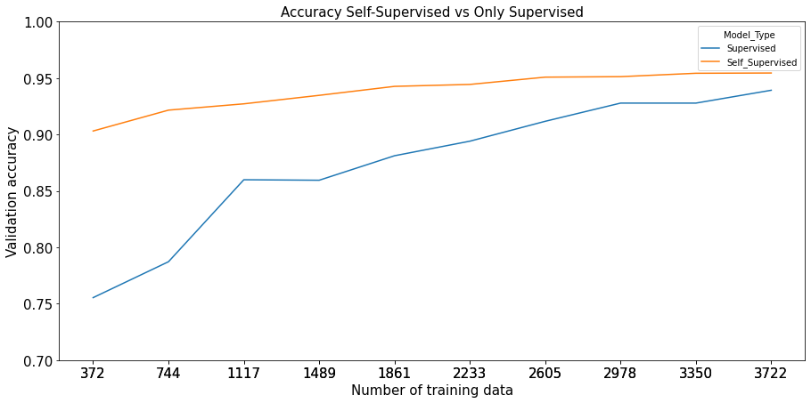

# Self Supervised Learning on Cats vs Dogs Image Classification
The question that this thread attempts to address is how much unlabeled data is needed to learn a visual representation that can compete with standard supervised learning with equivalent label data in the downstream task (image classification).

The response is discovered by running two simultaneous training sessions on ten separate data volumes, one with SSL and the other without. After the data is divided into ten stratified kfolds, and the algorithm feeds it to the pre-trained model resulted from the pretext task, with the last two layers fine-tuned. Simultaneously, the same data volume is fed to a ResNet model that has not been trained. THe resulted accuracy of image classifier is compared in both scenarios to draw a conclusion about the number of labelled data influencing the downstream task. 

This project is inspired by [Lars Vagnes implemntation of SSL for Image Classification on Cifar-10 dataset](https://medium.com/analytics-vidhya/self-supervised-learning-for-image-classification-263e320fff07) using the image rotation methedology from  [RotNet paper](https://arxiv.org/pdf/1803.07728.pdf).We implemnt some modification in the Lars Vagnes code by changing dataset, augmentations, hyeperparameters, and performing network visualizations

## Requirements
The script is tested on google colab with Python 3.7.10

## Dependencies and installation
pip install tensorflow

pip install tensorflow_datasets

pip install keras

Note: If script is used via google colab, no need for dependencies installation 

## Results

The downstream classification model pretrained by self supervised learning achieves 14.8% extra accuracy compared to the supervised model when trained on 2% of labelled training data of cats and dogs 
